# Add Student Module - Manual Guide

## Overview
This comprehensive manual guide provides step-by-step instructions for adding a new student to the Edwyze School Management System. The Add Student module is a 7-step process that captures all essential student information including personal details, contact information, guardian details, academic information, fees, transport, and documents.

## Prerequisites
- Admin access to the Edwyze system
- Valid login credentials
- Access to the Student Management module

## Login Process

### Step 1: Access the System
1. Open your web browser and navigate to: `https://edwyze.com/login`
2. Enter your login credentials:
   - **Email**: Test2@gmail.com
   - **Password**: Test@123#
3. Click the "Login" button to access the admin dashboard

### Step 2: Navigate to Student Management
1. From the admin dashboard, locate the "Students" option in the left navigation menu
2. Click on "Students" to access the Student Management page

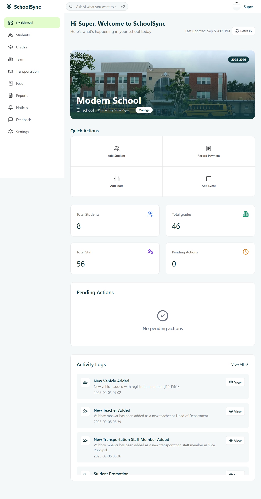

### Step 3: Access Add Student Module
1. On the Student Management page, click the "Add Student" button
2. This will open the Add Student form with a 7-step process

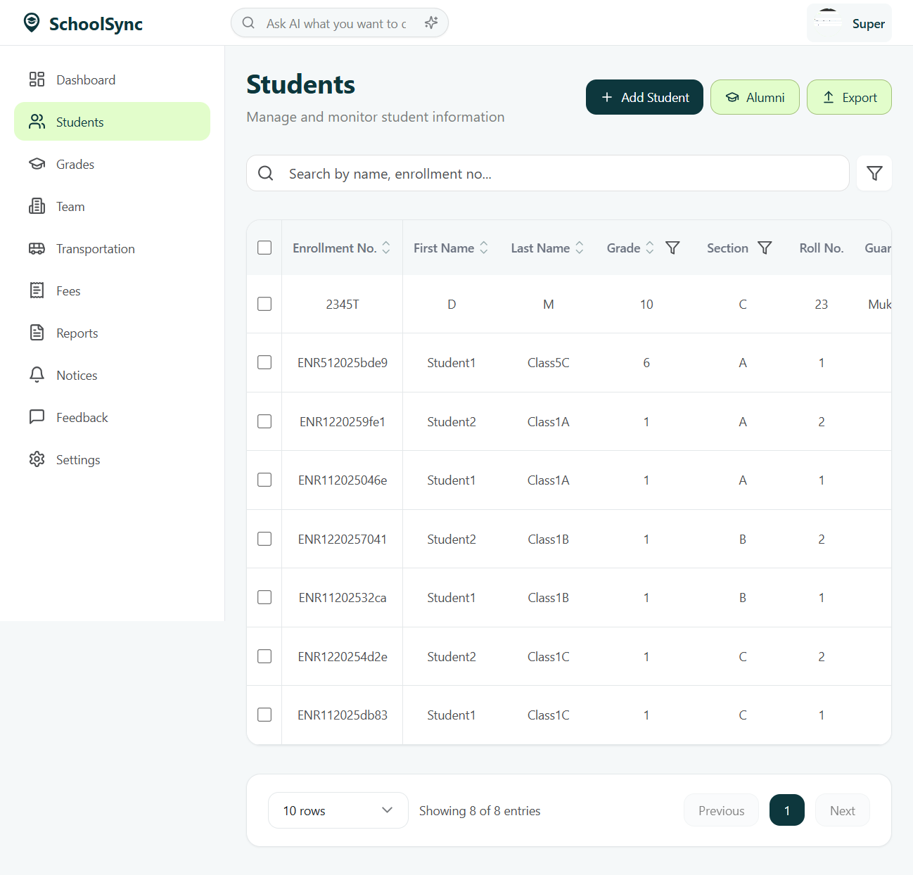

---

## Add Student Process (7 Steps)

### Step 1: Personal Details

**Purpose**: Capture basic personal information about the student

**Required Fields**:
- First Name *
- Last Name *
- Enrollment Number *
- Date of Birth *
- Gender *
- Email Address *

**Optional Fields**:
- Middle Name
- Roll Number
- Contact Number
- Nationality
- Aadhaar Number
- APAAR Number

**Instructions**:
1. Fill in the student's first name (e.g., "John")
2. Enter middle name if applicable (e.g., "Michael")
3. Enter last name (e.g., "Smith")
4. Provide a unique enrollment number (e.g., "ENR2025001")
5. Enter roll number if available (e.g., "25")
6. Select date of birth using the date picker (e.g., "2010-05-15")
7. Choose gender from the dropdown (Male/Female/Other)
8. Enter a valid email address (e.g., "john.smith@example.com")
9. Add contact number with country code (e.g., "9876543210")
10. Select nationality from the dropdown (e.g., "Indian")
11. Enter Aadhaar number if available (e.g., "1234 5678 9012")
12. Enter APAAR number if available (e.g., "9876 5432 1098")
13. Optionally upload a profile picture (Max 5MB, JPG/PNG formats)
14. Click "Next" to proceed to Step 2

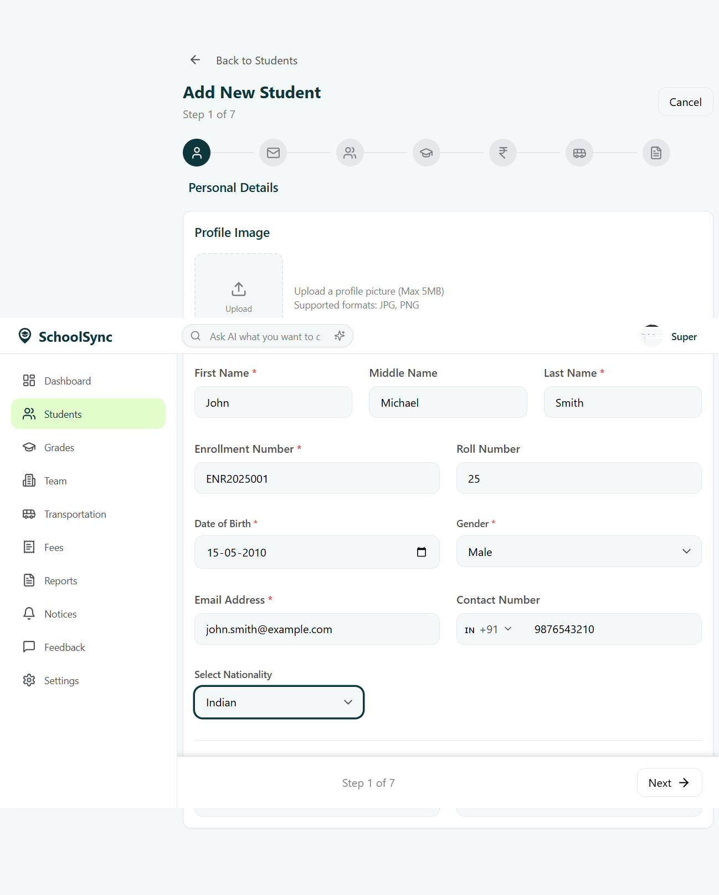

### Step 2: Contact Details

**Purpose**: Capture residential and permanent address information

**Required Fields**:
- Residential Address (Address Line 1, Country, State, City, Postal Code)

**Optional Fields**:
- Address Line 2
- Permanent Address (can be same as residential)

**Instructions**:
1. **Residential Address**:
   - Enter street address (e.g., "123 Main Street")
   - Add apartment/suite details if applicable (e.g., "Apt 4B")
   - Select country from dropdown (e.g., "India")
   - Choose state from dropdown (e.g., "Delhi")
   - Select city from dropdown (e.g., "New Delhi")
   - Enter postal code (e.g., "110001")

2. **Permanent Address**:
   - Check "Same as residential address" if applicable
   - OR fill in separate permanent address details

3. Click "Next" to proceed to Step 3

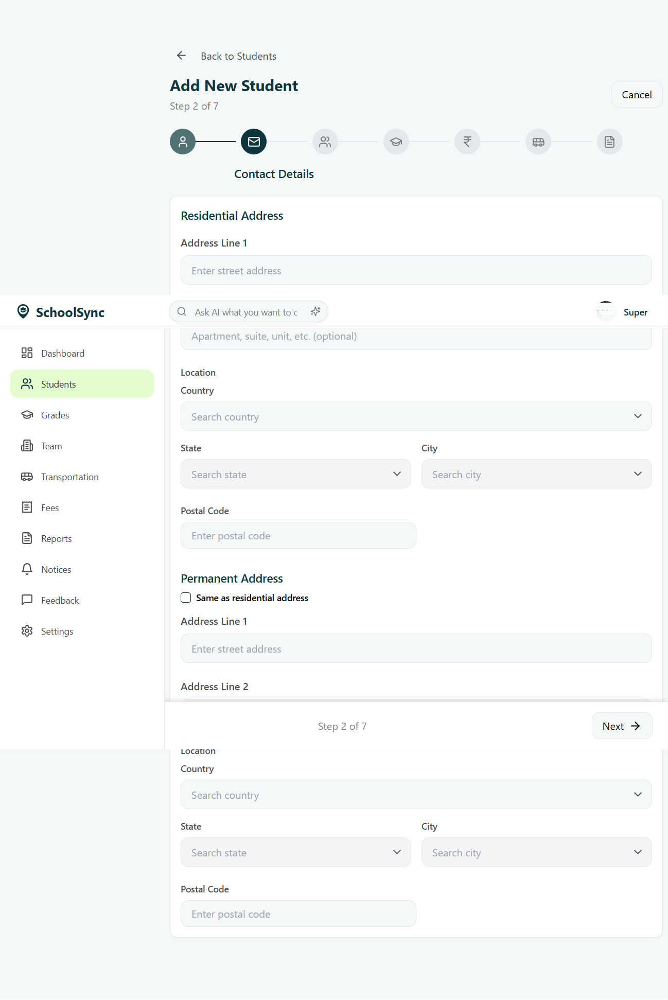
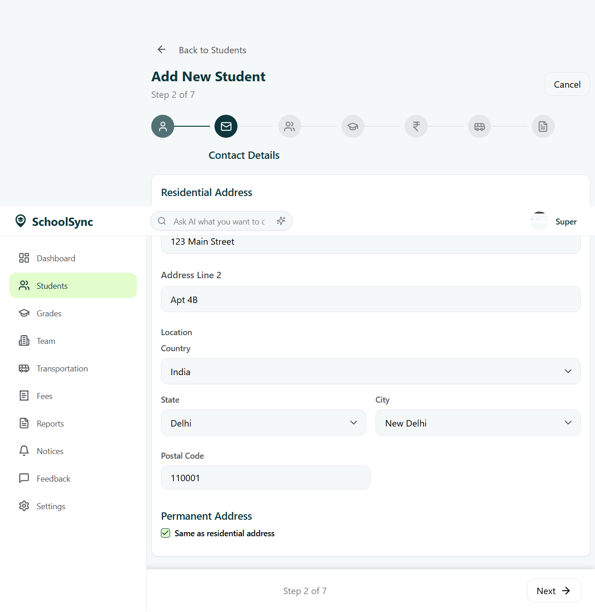

### Step 3: Guardian Details

**Purpose**: Capture information about the student's guardian/parent

**Required Fields**:
- Guardian Name *
- Relationship *
- Contact Number *
- Email Address *
- Address *

**Optional Fields**:
- Guardian Photo
- Emergency Contact designation

**Instructions**:
1. Click "Add Guardian" button
2. Fill in guardian information:
   - Enter full name (e.g., "Robert Smith")
   - Select relationship from dropdown (Father/Mother/Grandfather/Grandmother/Uncle/Aunt/Guardian/Other)
   - Enter contact number (e.g., "9876543210")
   - Provide email address (e.g., "robert.smith@example.com")
   - Enter complete address (e.g., "123 Main Street, Apt 4B, New Delhi, Delhi 110001")
3. Optionally upload guardian photo (Max 5MB, JPG/PNG formats)
4. Enable "Emergency Contact" toggle if this guardian should be contacted in emergencies
5. Note: "Primary Guardian" is automatically enabled for the first guardian
6. Click "Next" to proceed to Step 4

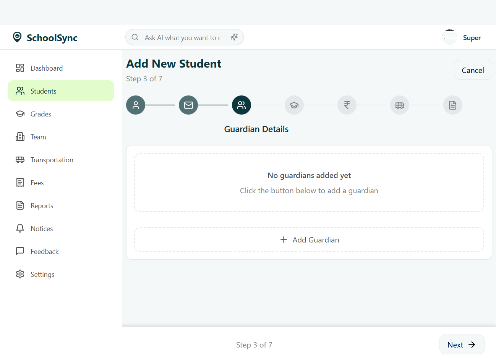
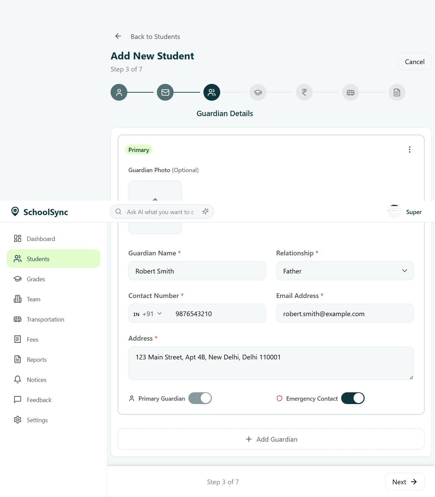

### Step 4: Academic Details

**Purpose**: Assign class, section, academic year, and subjects

**Required Fields**:
- Class *
- Section *
- Academic Year *

**Optional Fields**:
- Elective Subjects (up to 3)

**Instructions**:
1. **Class Selection**:
   - Select class from dropdown (e.g., "5")
   - This will enable the section dropdown and load available subjects

2. **Section Selection**:
   - Choose section from dropdown (e.g., "A")

3. **Academic Year**:
   - Select academic year (e.g., "2025-2026 (Current)")

4. **Subject Selection**:
   - **Core Subjects**: Automatically selected and cannot be changed
     - English (Primary)
     - Hindi (Primary)
     - Mathematics (Primary)
     - Environmental Studies
     - Social Studies (Primary)
     - English
   - **Elective Subjects**: Select up to 3 from available options
     - Computer Science (Primary)
     - Physical Education (Primary)
     - Art Education (Primary)

5. Click "Next" to proceed to Step 5

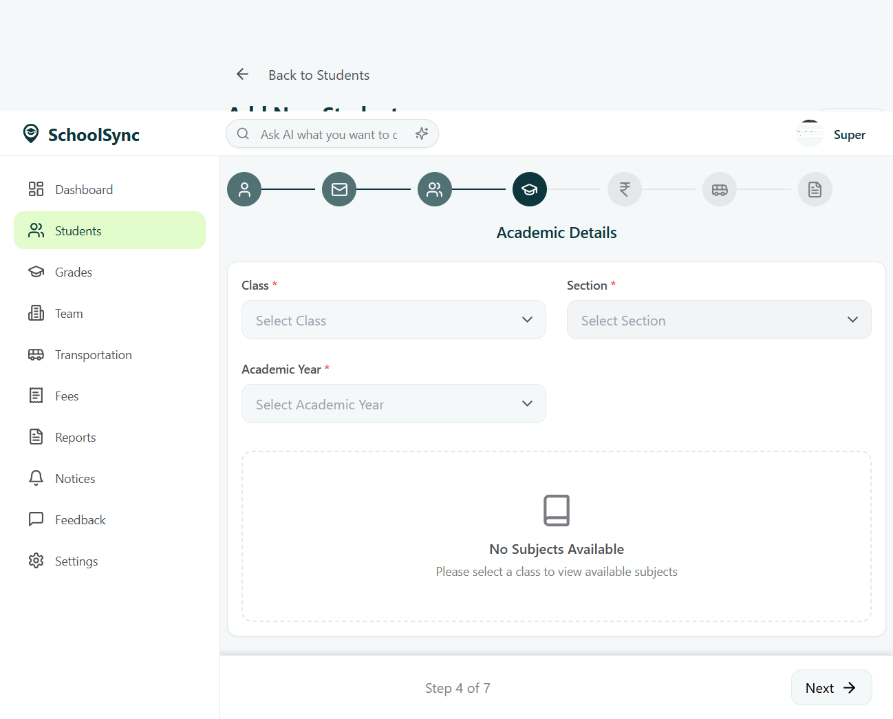
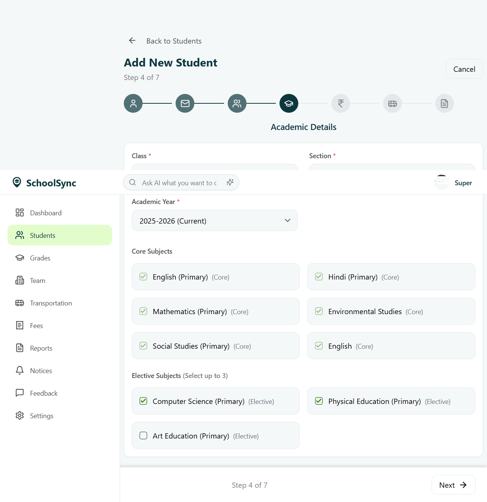

### Step 5: Fee Details

**Purpose**: Assign fee templates and manage fee structure

**Optional Step**: This step is optional and can be skipped

**Instructions**:
1. **Fee Templates**:
   - Click "Assign New Template" to add fee templates
   - Templates will be displayed in the list once assigned

2. **Fee Summary**:
   - Total fee amount is automatically calculated based on assigned templates
   - Currently shows ₹0.00 if no templates are assigned

3. Click "Next" to proceed to Step 6

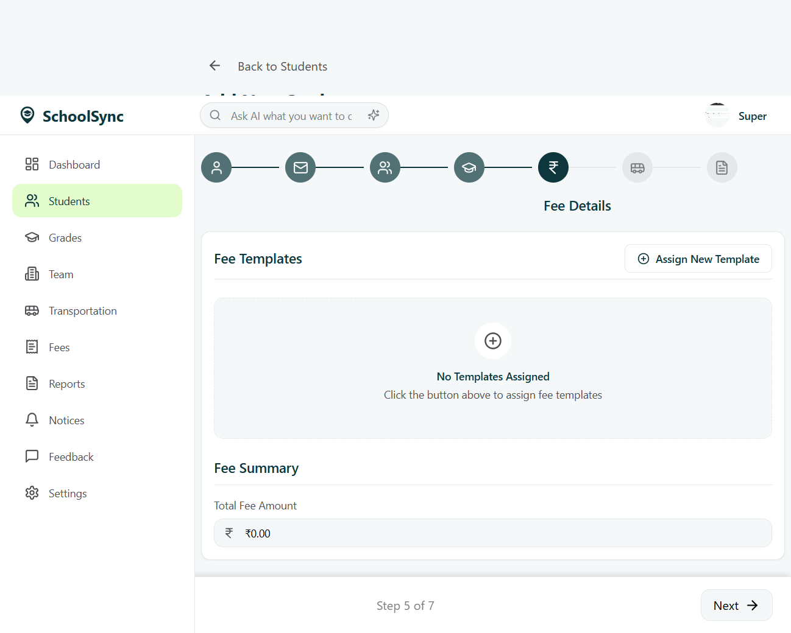

### Step 6: Transport Details

**Purpose**: Configure transportation options and authorized persons

**Optional Step**: This step is optional and can be skipped

**Instructions**:
1. **Transport Mode**:
   - Select "Private" (default) or "School Bus"
   - Private: Student uses personal transport
   - School Bus: Student uses school transportation

2. **Authorized Persons** (Optional):
   - Click "Add Person" to add authorized persons for drop/receive
   - Add person details including name, relationship, and contact information

3. Click "Next" to proceed to Step 7

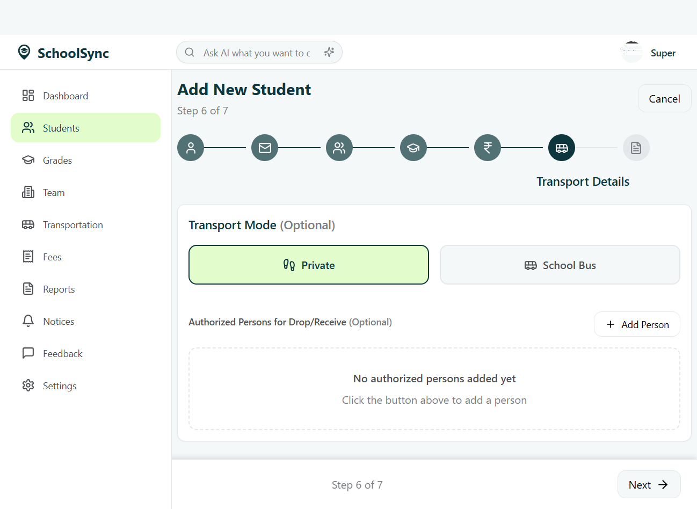

### Step 7: Documents

**Purpose**: Upload required documents for student enrollment

**Optional Step**: This step is optional and can be skipped

**Instructions**:
1. **Document Upload**:
   - Drag and drop files into the upload area
   - OR click to select files from your computer
   - Accepted formats: PDF, JPEG, PNG (Max 5MB per file)

2. **Required Documents** (if applicable):
   - Birth Certificate
   - Transfer Certificate
   - Medical Certificate
   - Previous Academic Records
   - Address Proof
   - Other relevant documents

3. **Final Submission**:
   - Review all information before submitting
   - Click "Submit" to complete the student registration
   - OR click "Previous" to go back and make changes

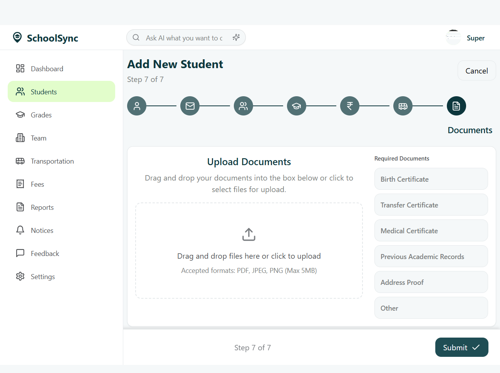

---

## Navigation Features

### Step Navigation
- Use the step buttons at the top to jump between steps
- Use "Previous" and "Next" buttons to navigate sequentially
- Progress indicator shows "Step X of 7"

### Form Validation
- Required fields are marked with asterisk (*)
- Form validation occurs when clicking "Next"
- Error messages will appear for incomplete required fields

### Data Persistence
- Form data is automatically saved as you progress through steps
- You can navigate back and forth without losing entered information

---

## Best Practices

### Data Entry
1. **Accuracy**: Double-check all entered information for accuracy
2. **Completeness**: Fill in all required fields before proceeding
3. **Consistency**: Ensure data consistency across all steps
4. **Validation**: Verify email addresses and phone numbers

### File Uploads
1. **Format**: Use only supported file formats (JPG, PNG, PDF)
2. **Size**: Keep file sizes under 5MB
3. **Quality**: Ensure documents are clear and readable
4. **Naming**: Use descriptive file names for easy identification

### Security
1. **Privacy**: Ensure student data is handled confidentially
2. **Access**: Only authorized personnel should access student information
3. **Backup**: Regular backups of student data are recommended

---

## Troubleshooting

### Common Issues

**Issue**: Cannot proceed to next step
- **Solution**: Check that all required fields are filled
- **Solution**: Verify that dropdown selections are made

**Issue**: File upload fails
- **Solution**: Check file size (must be under 5MB)
- **Solution**: Verify file format (JPG, PNG, PDF only)

**Issue**: Email validation error
- **Solution**: Ensure email format is correct (user@domain.com)
- **Solution**: Check for typos in email address

**Issue**: Phone number validation error
- **Solution**: Include country code (+91 for India)
- **Solution**: Use only numeric characters

### Support
- Contact system administrator for technical issues
- Refer to system documentation for advanced features
- Check system status if experiencing connectivity issues

---

## Conclusion

The Add Student module provides a comprehensive and user-friendly interface for registering new students in the Edwyze School Management System. By following this manual guide, administrators can efficiently capture all necessary student information through a structured 7-step process.

The system ensures data integrity through validation, provides flexibility with optional fields, and maintains a consistent user experience across all steps. Regular updates and improvements to the system may result in minor interface changes, but the core functionality remains consistent.

For additional support or advanced features, please refer to the system documentation or contact the technical support team.

---

**Document Version**: 1.0  
**Last Updated**: January 2025  
**System**: Edwyze School Management System  
**Module**: Add Student
